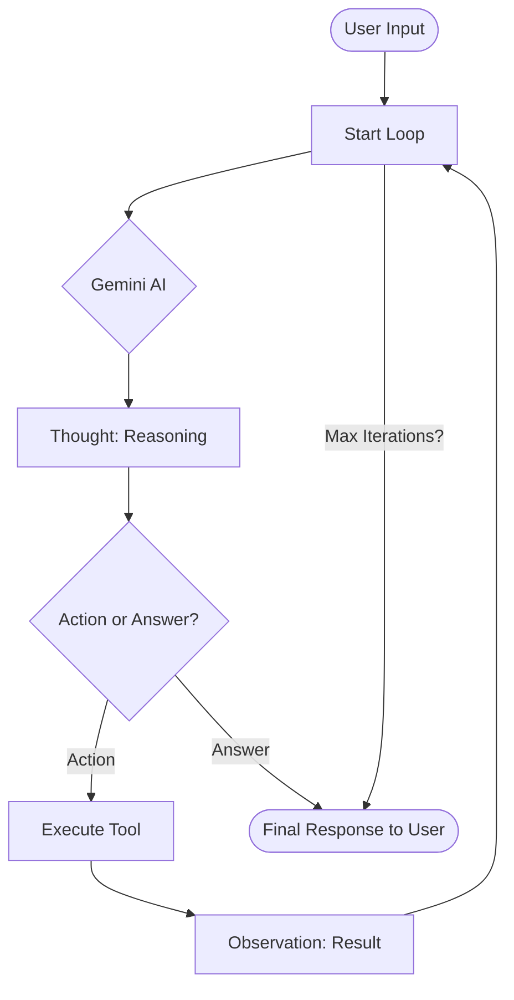
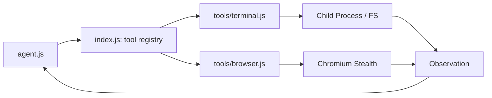

# System Architecture Diagrams

This document visualizes the core flows of Orbital to help maintainers and future agents understand the project logic quickly.

## ReAct Loop Flow

The ReAct (Reasoning + Acting) loop is the heart of Orbital.

## Tool Execution Flow

How Orbital interfaces with the local system.

---

> [!TIP]
> When adding new tool categories, ensure you update this Tool Execution Flow diagram.
